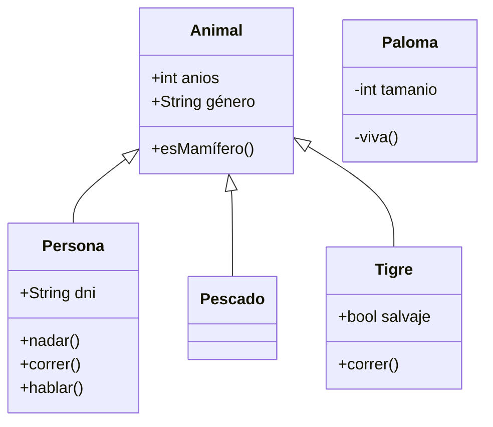

+++
title = 'Diagramas'
date = 2023-09-19T11:11:55+02:00
draft = false
+++


graph LR;
    While --> Then
    



graph LR;
    If --> Then
    Then -->Else


Diagrama


---
title: Ejemplo
---
graph LR;
    A[Única Opción] --> C{<strong>Decisión</strong>}
    C -->|Uno| D[Primer Resultado]
    C -->|Dos| E[Segundo Resultado]


Diagrama de sequencias


%%{init:{"fontFamily":"Times New Roman", "sequence":{"showSequenceNumbers":true}}}%%
sequenceDiagram
    Alice->>John: Hola, como te llamas?
    Note right of John: Ejemplo
    John-->>Alice: John!
    John->>Bob: Cómo estas?
    Bob-->>John: Bien!


Diagrama de clases

Diagrama de estado


stateDiagram-v2
    open: Open Door
    closed: Closed Door
    locked: Locked Door
    open   --> closed: Close
    closed --> locked: Lock
    locked --> closed: Unlock
    closed --> open: Open


Diagrama entidad-relacion

%%{init:{"theme":"forest"}}%%
erDiagram
    CUSTOMER }|..|{ DELIVERY-ADDRESS : has
    CUSTOMER ||--o{ ORDER : places
    CUSTOMER ||--o{ INVOICE : "liable for"
    DELIVERY-ADDRESS ||--o{ ORDER : receives
    INVOICE ||--|{ ORDER : covers
    ORDER ||--|{ ORDER-ITEM : includes
    PRODUCT-CATEGORY ||--|{ PRODUCT : contains
    PRODUCT ||--o{ ORDER-ITEM : "ordered in"


Recorrido

journey
    title My working day
    section Go to work
      Make tea: 5: Me
      Go upstairs: 3: Me
      Do work: 1: Me, Cat
    section Go home
      Go downstairs: 5: Me
      Sit down: 3: Me


Diagrama GANTT

gantt
        dateFormat  YYYY-MM-DD
        title Adding GANTT diagram functionality to Mermaid
        section A section
        Completed task            :done,    des1, 2014-01-06,2014-01-08
        Active task               :active,  des2, 2014-01-09, 3d
        Future task               :         des3, after des2, 5d
        Future task2              :         des4, after des3, 5d
        section Critical tasks
        Completed task in the critical line :crit, done, 2014-01-06,24h
        Implement parser and jison          :crit, done, after des1, 2d
        Create tests for parser             :crit, active, 3d
        Future task in critical line        :crit, 5d
        Create tests for renderer           :2d
        Add to Mermaid                      :1d


Diagrama de tarta


pie title Pets adopted by volunteers
    "Dogs" : 386
    "Cats" : 85
    "Rats" : 15


Carta cuadrangular


pie title Pets adopted by volunteers
    title Reach and engagement of campaigns
    x-axis Low Reach --> High Reach
    y-axis Low Engagement --> High Engagement
    quadrant-1 We should expand
    quadrant-2 Need to promote
    quadrant-3 Re-evaluate
    quadrant-4 May be improved
    Campaign A: [0.3, 0.6]
    Campaign B: [0.45, 0.23]
    Campaign C: [0.57, 0.69]
    Campaign D: [0.78, 0.34]
    Campaign E: [0.40, 0.34]
    Campaign F: [0.35, 0.78]


Diagrama de requisitos


    requirementDiagram

    requirement test_req {
    id: 1
    text: the test text.
    risk: high
    verifymethod: test
    }

    element test_entity {
    type: simulation
    }

    test_entity - satisfies -> test_req


Gráfico git


gitGraph
    commit
    commit
    branch develop
    checkout develop
    commit
    commit
    checkout main
    merge develop
    commit
    commit


Diagrama C4


C4Context
    title System Context diagram for Internet Banking System
    Enterprise_Boundary(b0, "BankBoundary0") {
    Person(customerA, "Banking Customer A", "A customer of the bank, with personal bank accounts.")
    Person(customerB, "Banking Customer B")
    Person_Ext(customerC, "Banking Customer C", "desc")

    Person(customerD, "Banking Customer D", "A customer of the bank,   with personal bank accounts.")

    System(SystemAA, "Internet Banking System", "Allows customers to view information about their bank accounts, and make payments.")

    Enterprise_Boundary(b1, "BankBoundary") {

        SystemDb_Ext(SystemE, "Mainframe Banking System", "Stores all of the core banking information about customers, accounts, transactions, etc.")

        System_Boundary(b2, "BankBoundary2") {
        System(SystemA, "Banking System A")
        System(SystemB, "Banking System B", "A system of the bank, with personal bank accounts. next line.")
        }

        System_Ext(SystemC, "E-mail system", "The internal Microsoft Exchange e-mail system.")
        SystemDb(SystemD, "Banking System D Database", "A system of the bank, with personal bank accounts.")

        Boundary(b3, "BankBoundary3", "boundary") {
        SystemQueue(SystemF, "Banking System F Queue", "A system of the bank.")
        SystemQueue_Ext(SystemG, "Banking System G Queue", "A system of the bank, with personal bank accounts.")
        }
    }
    }

    BiRel(customerA, SystemAA, "Uses")
    BiRel(SystemAA, SystemE, "Uses")
    Rel(SystemAA, SystemC, "Sends e-mails", "SMTP")
    Rel(SystemC, customerA, "Sends e-mails to")

    UpdateElementStyle(customerA, $fontColor="red", $bgColor="grey", $borderColor="red")
    UpdateRelStyle(customerA, SystemAA, $textColor="blue", $lineColor="blue", $offsetX="5")
    UpdateRelStyle(SystemAA, SystemE, $textColor="blue", $lineColor="blue", $offsetY="-10")
    UpdateRelStyle(SystemAA, SystemC, $textColor="blue", $lineColor="blue", $offsetY="-40", $offsetX="-50")
    UpdateRelStyle(SystemC, customerA, $textColor="red", $lineColor="red", $offsetX="-50", $offsetY="20")

    UpdateLayoutConfig($c4ShapeInRow="3", $c4BoundaryInRow="1")


